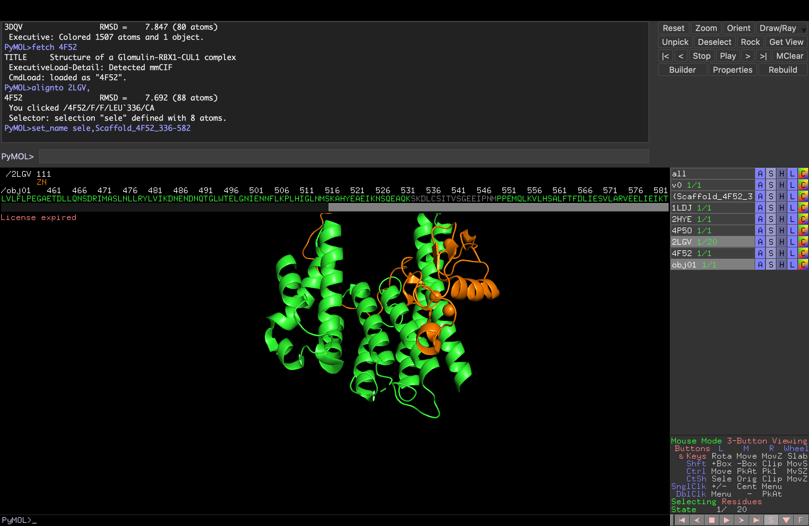
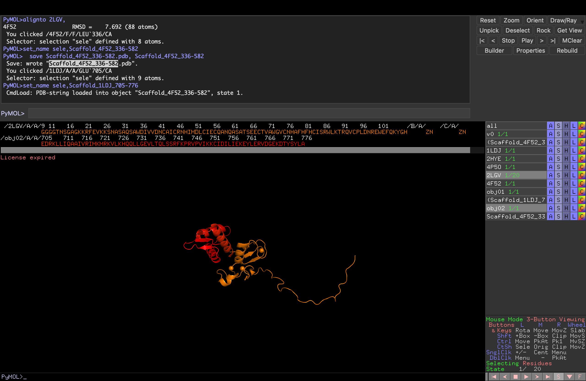

# Lab Notebook: RBX1 Binder Design
**Competition:** GEM x Adaptyv Bio — RBX1 Binder Design Challenge
**Submission deadline:** March 26, 2026
**Experimenter:** Tamuka Martin Chidyausiku @steamulater

---

## Project Overview

Design up to 100 *de novo* protein binder sequences targeting RBX1 (Ring-Box Protein 1) for experimental validation via bio-layer interferometry at Adaptyv's Foundry.

**Constraints:**
- Max 250 amino acids per sequence
- Min 25% edit distance from UniRef50 (or SAbDab for sdAbs)
- Up to 100 sequences

---

## Target: RBX1

**UniProt:** P62877 | **PDB:** 2LGV | **Organism:** *Homo sapiens*

**Full sequence (108 AA):**
```
GGGGTNSGAGKKRFEVKKSNASAQSAWDIVVDNCAICRNHIMDLCIECQANQASATSEECTVAWGVCNHAFHFHCISRWLKTRQVCPLDNREWEFQKYGH
```

**Domain architecture:**
| Region | Residues | Description |
|--------|----------|-------------|
| Disordered N-terminus | 1–31 | Intrinsically disordered, poor binder target |
| RING-H2 domain | 32–90 | Coordinates 3 Zn2+ ions; primary target |
| RING catalytic core | 45–90 | E2 ubiquitin-conjugating enzyme binding surface |
| C-terminal tail | 91–108 | — |

**Function:** Catalytic subunit of Cullin-RING E3 ubiquitin ligase (CRL) complexes. Recruits E2 enzymes to drive ubiquitination of ~20% of cellular proteins, regulating cell cycle, DNA repair, and signal transduction.

**Therapeutic rationale:** CRL activity is frequently dysregulated in cancer. Blocking the RBX1 E2-binding surface on the RING-H2 domain disrupts ubiquitin transfer and could inhibit oncogenic CRL-mediated protein degradation.

**Primary epitope target:** The E2-binding surface on the RING-H2 domain (residues ~45–90), particularly the zinc-coordinating residues and the E2-docking loops.

---

## Design Strategies

Two parallel strategies are being pursued to maximise the diversity and quality of the 100 submissions.

---

### Strategy 1: De Novo Backbone Generation (RFdiffusion + ProteinMPNN)

Generate entirely new binder backbones conditioned on the RBX1 RING-H2 surface, then design sequences with ProteinMPNN.

```
RBX1 structure (2LGV)
        |
        v
[1] RFdiffusion  [Colab A100]
    - Hotspot residues: RING-H2 surface (res 45-90)
    - Generate ~500 binder backbones
        |
        v
[2] ProteinMPNN  [local, M3 MPS]
    - Design sequences for each backbone
    - 8 sequences per backbone
        |
        v
[3] ColabFold AF2-multimer  [Colab A100]
    - Predict RBX1:binder complex structures
    - Score by ipTM, pLDDT, interface contacts
        |
        v
[4] Novelty filter
    - mmseqs2 vs UniRef50
    - Retain sequences with ≥25% edit distance
        |
        v
[5] Rank & select top N
    - ipTM > 0.7 cutoff
    - Interface score (ΔG, buried SASA)
    - Sequence diversity
```

**Rationale:** Maximally novel binders; not constrained to known binding modes.

---

### Strategy 2a: Scaffold-Based Redesign — Glomulin (4F52)

Use the experimentally validated Glomulin backbone — a natural inhibitor of CRL activity that occupies the E2-docking surface of RBX1's RING domain — as the starting scaffold for ProteinMPNN sequence redesign.

**Scaffold:** PDB 4F52, chain F (Glomulin), residues 336–582 | 247 AA | UniProt Q92990
**Missing residues in crystal structure:** 433–438 (6 AA), 533–549 (17 AA) — to be modelled with Boltz-1

```
PDB 4F52 (Glomulin-RBX1-CUL1 crystal structure)
        |
        v
[1] PyMOL  [local]
    - Align 4F52 against 2LGV (RMSD = 7.692 Å on 88 atoms)
    - Extract Glomulin chain F, residues 336-582 (247 AA)
    - Save as Scaffold_4F52_336-582.pdb
        |
        v
[2] Boltz-1  [ColabFold + tier]
    - Monomer: glmn_monomer.yaml — predict complete structure with missing loops
    - Complex: glmn_rbx1_complex.yaml — validate PPI with RBX1
    - 5 diffusion samples each; assess ipTM consistency across models
        |
        v
[3] ProteinMPNN  [local, M3 MPS]
    - Fixed receptor: RBX1 RING-H2
    - Redesign Glomulin scaffold sequence
    - 8-16 sequences per run, multiple temperature settings
        |
        v
[4] Boltz-1 / ColabFold AF2-multimer  [Colab A100]
    - Validate redesigned sequences in complex with RBX1
    - Score by ipTM, pLDDT
        |
        v
[5] Novelty filter → mmseqs2 vs UniRef50 (≥25% edit distance)
        |
        v
[6] Rank & select top N
```

**Rationale:** Glomulin is a natural CRL inhibitor; backbone geometry is experimentally validated against the exact E2-docking surface. 247 AA — at the competition limit.

**Key structural references:**
- 4F52 scaffold: chain F, residues 336–582
- Aligned to 2LGV (RBX1 NMR): RMSD = 7.692 Å on 88 atoms



---

### Strategy 2b: Scaffold-Based Redesign — CUL1 WHB domain (1LDJ)

Use the C-terminal winged-helix B (WHB) domain of Cullin-1 that directly cradles the RBX1 RING domain as a compact (72 AA) scaffold for ProteinMPNN redesign.

**Scaffold:** PDB 1LDJ, chain A (CUL1), residues 705–776 | 72 AA | UniProt Q13616
**Sequence:** `EDRKLLIQAAIVRIMKMRKVLKHQQLLGEVLTQLSSRFKPRVPVIKKCIDILIEKEYLERVDGEKDTYSYLA`

```
PDB 1LDJ (CUL1-RBX1-SKP1-SKP2 SCF complex)
        |
        v
[1] PyMOL  [local]
    - Extract CUL1 chain A, residues 705-776 (72 AA)
    - Save as Scaffold_1LDJ_705-776.pdb
        |
        v
[2] Boltz-1  [ColabFold + tier]
    - Monomer: cul1_whb_monomer.yaml — predict standalone WHB structure
    - Complex: cul1_whb_rbx1_complex.yaml — validate PPI with RBX1
    - 5 diffusion samples each; assess ipTM consistency across models
        |
        v
[3] ProteinMPNN  [local, M3 MPS]
    - Redesign WHB scaffold sequence
    - 8-16 sequences per run, multiple temperature settings
        |
        v
[4] Boltz-1 / ColabFold AF2-multimer validation → novelty filter → rank
```

**Rationale:** Much more compact than Glomulin (72 vs 247 AA), leaving headroom for linkers or extensions. The WHB domain is the direct structural contact between Cullin and the RBX1 RING domain.

**Key structural references:**
- 1LDJ scaffold: chain A, residues 705–776
- Aligned to 2LGV (RBX1 NMR): RMSD = 7.692 Å on 88 atoms



**Compute:** ProteinMPNN runs locally on M3 (MPS-accelerated); Boltz-1 and validation on ColabFold + tier ($50/month)

---

## Experiment Log

---

### Entry 001 — 2026-03-22

**Status:** Project initialized

**Work completed:**
- Reviewed RBX1 biology and domain architecture via BioReason analysis
- Identified RING-H2 domain (res 32–90) as primary binding epitope
- Identified E2-binding surface (res 45–90) as key functional hotspot
- Retrieved full-length structure PDB: 2LGV, inspected in PyMOL
- Confirmed disordered N-terminus (res 1–31) is a poor binder target
- Established computational pipeline: RFdiffusion → ProteinMPNN → ColabFold → filter → rank

**Key structural observations from 2LGV:**
- RING-H2 domain is well-structured and amenable to binder design
- Three zinc coordination sites create a rigid scaffold
- E2-docking surface is solvent-exposed and flat — will need binders with concave interface or extended loops
- N-terminal ~31 residues are disordered in solution (NMR structure)

**Next steps:**
- [ ] Prepare RBX1 input structure for RFdiffusion (extract RING-H2 domain, define hotspot residues)
- [ ] Run RFdiffusion backbone generation on Colab
- [ ] Run ProteinMPNN sequence design on generated backbones
- [ ] Validate with ColabFold AF2-multimer
- [ ] Filter for novelty and rank top 100

---

### Entry 002 — 2026-03-22

**Status:** Complete

**Work completed:**
- Identified confirmed PDB structures containing human RBX1 (4F52, 2HYE, 5N4W, 8Q7H, 1LDJ)
- Selected 4F52 (Glomulin-RBX1-CUL1) as scaffold source for Strategy 2a
- Loaded 4F52 in PyMOL, aligned against 2LGV (RMSD = 7.692 Å on 88 atoms)
- Extracted Glomulin chain F residues 336–582 (247 AA) → `Scaffold_4F52_336-582.pdb`
- Found 2 gaps in crystal structure: res 433–438 (6 AA) and 533–549 (17 AA)
- Selected 1LDJ CUL1 WHB domain (chain A, res 705–776, 72 AA) as Strategy 2b scaffold → `Scaffold_1LDJ_705-776.pdb`
- Decided to use Boltz-1 on ColabFold to model complete structures (fills missing loops better than ESMFold)
- Set up local ProteinMPNN environment (conda env: `proteinmpnn`, PyTorch 2.10, MPS enabled)
- Created 4 Boltz-1 YAML input files in `boltz_inputs/`

**Key sequences confirmed:**
- RBX1 (P62877): 108 AA — `MAAAMDVDTPSGTNSGAGKKRFEVKKWNAVALWAW...`
- Glomulin 336–582 (Q92990): 247 AA
- CUL1 WHB 705–776 (Q13616): 72 AA — `EDRKLLIQAAIVRIMKMRKVLKHQQLLGEVLTQ...`

**Next steps:**
- [ ] Run 4 Boltz-1 jobs on ColabFold (5 diffusion samples each)
- [ ] Assess ipTM in complex predictions — confirm both scaffolds form PPI with RBX1
- [ ] Use best Boltz monomer outputs as ProteinMPNN scaffolds
- [ ] Run ProteinMPNN redesign locally (Strategies 2a and 2b)
- [ ] Set up RFdiffusion Colab run (Strategy 1)
- [ ] Validate all designs with ColabFold AF2-multimer
- [ ] Filter for novelty and rank top 100

---

### Entry 003 — 2026-03-22

**Status:** Complete

**Work completed:**
- BLAST verified all three sequences against SwissProt (NCBI blastp)
- All sequences confirmed 100% identity to correct human proteins at correct positions

**BLAST results:**

| Sequence | BLAST Top Hit | Identity | Position | NCBI RID |
|----------|--------------|----------|----------|----------|
| RBX1 | P62877 — E3 ubiquitin-protein ligase RBX1, *H. sapiens* | 108/108 (100%) | 1–108 | W1DWTW13014 |
| Glomulin 336–582 | Q92990 — Glomulin (FAP), *H. sapiens* | 247/247 (100%) | 336–582 | W1DWUCET014 |
| CUL1 705–776 | Q13616 — Cullin-1, *H. sapiens* | 72/72 (100%) | 705–776 | W1DWU7Y7014 |

All sequences verified correct. Boltz-1 YAML inputs confirmed ready to submit.

**Next steps:**
- [ ] Submit 4 Boltz-1 jobs on ColabFold (5 diffusion samples each)
- [ ] Assess complex ipTM — confirm both scaffolds form PPI with RBX1

---

## Sequences Submitted

| # | Sequence ID | Length (AA) | ipTM | pLDDT | Edit dist. | Notes |
|---|-------------|-------------|------|-------|------------|-------|
| — | — | — | — | — | — | — |

---

## Resources

- Competition page: GEM x Adaptyv RBX1 Binder Design Challenge
- Target PDB: [2LGV](https://www.rcsb.org/structure/2LGV)
- RFdiffusion Colab: [RFdiffusion notebook](https://colab.research.google.com/github/sokrypton/ColabDesign/blob/v1.1.1/rf/examples/diffusion.ipynb)
- ProteinMPNN Colab: [ProteinMPNN notebook](https://colab.research.google.com/github/dauparas/ProteinMPNN/blob/main/colab_notebooks/quickdemo.ipynb)
- ColabFold: [ColabFold notebook](https://colab.research.google.com/github/sokrypton/ColabFold/blob/main/AlphaFold2.ipynb)
