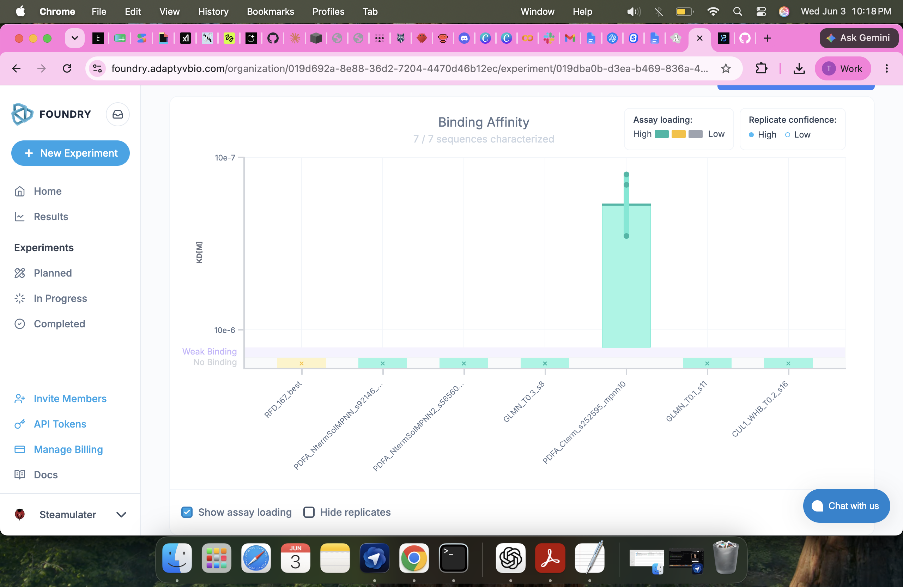
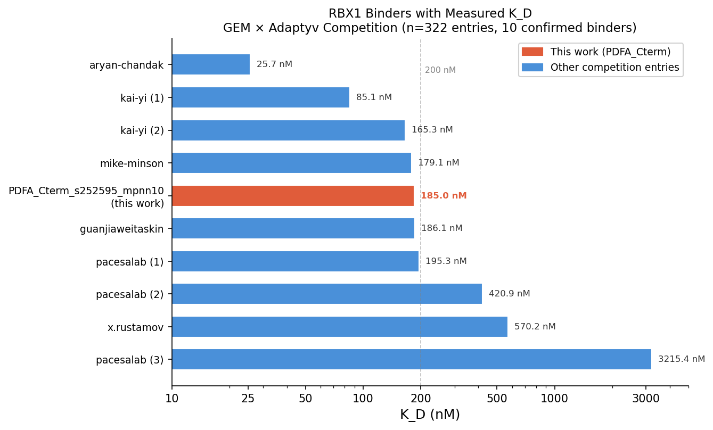

# RBX1 Binder Design — Summary Report
**Team:** Steamulater × Protein Design for Africa (PDFA)
**Competition:** GEM × Adaptyv Bio RBX1 Binder Design Challenge (deadline March 26, 2026)
**Experimenter:** Tamuka Martin Chidyausiku · @steamulater
**Validation:** Adaptyv Foundry BLI assay, experiment SUL-001-002 (completed June 2026)

---

## Target

Human RBX1 (UniProt P62877) — catalytic RING-H2 subunit of Cullin-RING E3 ubiquitin ligase complexes. Directs ubiquitination of ~20% of cellular proteins; dysregulated in cancer. Primary epitope: E2-binding surface on the RING-H2 domain (residues 45–90).

---

## Design Campaign

100 sequences submitted across three parallel strategies:

| Strategy | Tool | Sequences | Boltz-2 iptm range |
|----------|------|-----------|-------------------|
| De novo backbone | RFdiffusion + ProteinMPNN | 47 | 0.710–0.910 |
| GLMN scaffold redesign (PDB 4F52) | ProteinMPNN | 46 | 0.846–0.887 |
| CUL1 WHB scaffold redesign (PDB 1LDJ) | ProteinMPNN | 7 | 0.41–0.761 |

Post-competition, the top 7 designs were co-selected with **Protein Design for Africa (PDFA)** — a Nigerian student group who applied BindCraft + BoltzGen on IDR-truncated RBX1 (PDB 3DQV). All 14 PDFA designs were re-scored on Boltz-2 for a standardised comparison; their top 6 exceeded our best GLMN design.

**Final 7-design panel** (3 PDFA + 2 GLMN + 1 CUL1_WHB + 1 RFdiffusion) submitted to Adaptyv Foundry on April 22, 2026 following a direct invitation from Tudor-Stefan Cotet (tudor@adaptyvbio.com).

---

## Experimental Results — BLI (Adaptyv Foundry)

Assay: affinity characterisation, bio-layer interferometry, 3 replicates, 5 antigen concentrations (0–1000 nM).

| Design | Source | Boltz-2 iptm | BLI K_D | Result |
|--------|--------|-------------|---------|--------|
| `PDFA_Cterm_s252595_mpnn10` | PDFA | 0.918 | **185 nM** | **Confirmed binder** |
| `PDFA_NtermSolMPNN2_s565603_mpnn6` | PDFA | 0.927 | — | No binding |
| `PDFA_NtermSolMPNN_s92146_mpnn3` | PDFA | 0.910 | — | No binding |
| `GLMN_T0.1_s11` | Steamulater | 0.887 | — | No binding |
| `GLMN_T0.3_s8` | Steamulater | 0.878 | — | No binding |
| `RFD_167_best` | Steamulater | 0.848 | — | No binding |
| `CUL1_WHB_T0.2_s16` | Steamulater | 0.761 | — | No binding |

**`PDFA_Cterm_s252595_mpnn10` — replicate kinetics**

| Replicate | K_D | k_on (M⁻¹s⁻¹) | k_off (s⁻¹) |
|-----------|-----|----------------|-------------|
| 1 | 144 nM | 81,910 | 1.18×10⁻² |
| 2 | 126 nM | 50,767 | 6.38×10⁻³ |
| 3 | 286 nM | 31,098 | 8.89×10⁻³ |
| **Mean** | **185 nM** | **54,591** | **9.03×10⁻³** |

K_D log std = 0.156 — consistent signal across all 3 replicates.

---

## Context: Full Competition (322 entries)

**Hit rate:** 9/322 confirmed binders (2.8%) across the full competition. Our panel: **1/7 (14.3%) — 5× the field average.**

Of 322 entries, only 10 have a measured K_D. Our binder ranks **5th** (median of confirmed binders):

*Note: competition K_D values measured by SPR; ours by BLI.*

---

## Key Observations

- **C-terminal RBX1 surface is the productive epitope.** The PDFA C-terminal binder (targeting IDR-truncated 3DQV C-term) is the sole hit. Both PDFA N-terminal designs — ranked #1 and #3 by Boltz-2 iptm — showed no binding.
- **Boltz-2 iptm does not predict experimental outcome within a high-scoring cohort.** The highest-iptm design (mpnn6, 0.927) failed; the binder (mpnn10, 0.918) ranked 2nd. Consistent with Nipah retrospective (ipTM AUROC ~0.60).
- **GLMN scaffold redesign did not translate.** Strong computational scores (iptm 0.878–0.887, ring_rmsd <1 Å) did not produce binding. Large flat interface may require near-native sequence identity.
- **De novo miniprotein (RFD_167_best, 70 aa) did not bind.** Lowest peak BLI response (0.022 nm) suggests poor expression or folding in assay conditions.

---

## Next Steps

1. **Affinity maturation** of `PDFA_Cterm_s252595_mpnn10` (185 nM → target <25 nM, the competition best)
2. **Focus next design round on C-terminal RBX1 surface** using BindCraft + BoltzGen pipeline (PDFA approach validated)
3. **Request loading step traces** from Adaptyv Foundry for expression QC on all 7 designs
4. **Contact PDFA** (Oghenejabor Laurence Jaboro, Mcgregory Nosakhare Ogbomo) re: co-authorship if manuscript pursued

---

## References

### Methods

| Tool | Citation |
|------|----------|
| RFdiffusion | Watson J.L. et al. "De novo design of protein structure and function with RFdiffusion." *Nature* 620, 1089–1100 (2023). https://doi.org/10.1038/s41586-023-06415-8 |
| ProteinMPNN | Dauparas J. et al. "Robust deep learning–based protein sequence design using ProteinMPNN." *Science* 378, 49–56 (2022). https://doi.org/10.1126/science.add2187 |
| Boltz-2 | Wohlwend J. et al. "Boltz-1: Democratizing Biomolecular Interaction Modeling." *bioRxiv* (2024). https://doi.org/10.1101/2024.11.19.624167 |
| BindCraft | Pacesa M. et al. "BindCraft: one-shot protein binder design using AlphaFold2." *Nature* (2025). https://doi.org/10.1038/s41586-025-08741-7 |

### Data & Lab Records

| Document | Location |
|----------|----------|
| Full lab notebook (Entries 001–017) | `lab_notebook.md` |
| Submission writeup | `submission_writeup.md` |
| PDFA method writeup | `students_submission/Protein design for africa, method write up.pdf` |
| Boltz-2 PDFA standardisation notebook | `students_submission/boltz_pdfa_validation.ipynb` |
| Final 7 sequences (FASTA) | `students_submission/final_7_selected.fasta` |
| BLI raw data package | Adaptyv Foundry experiment SUL-001-002 |
| Proteinbase RBX1 competition dataset | https://proteinbase.com/collections/gem-x-adaptyv-rbx1-binder-design-competition-results |
| ProteWorks Studio sprint notes | `proteworks_studio/lab_notebook.md` |
